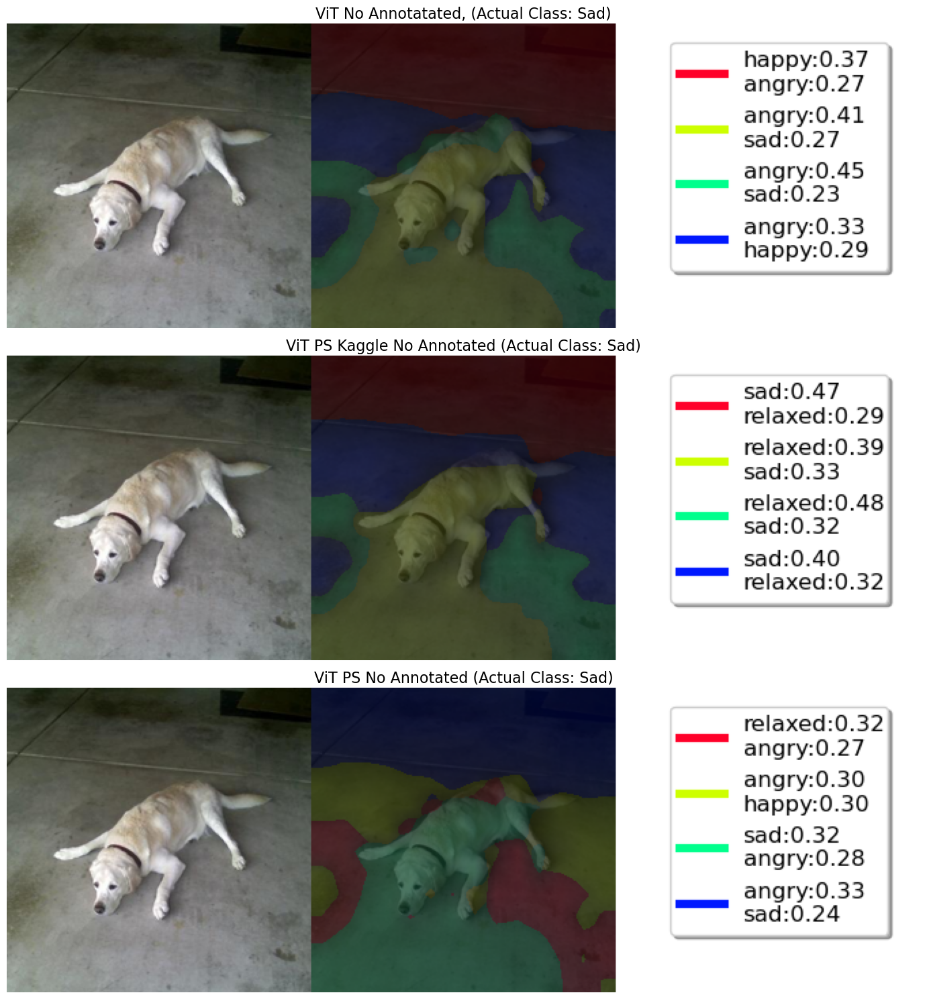
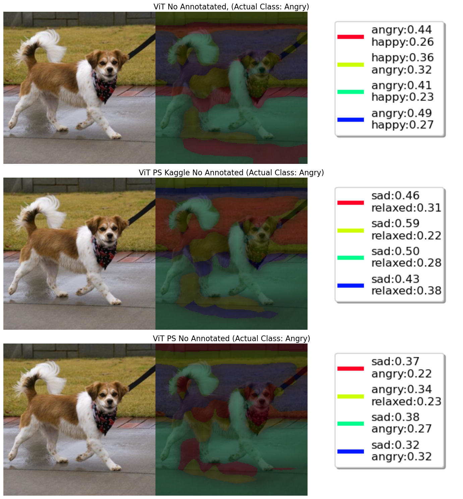

# is_the_dog_happy

We are trying to see, not just if a Computer Vision model is good for detecting emotions of a dog, but also how it vizulizes these results. What is the model looking for when trying to classify a doggo as "HAPPY", do the facial features make or break how a model predicts emotions in animals, does it view the same features differently or with different weightage if we tell it to focus on the face. 

## Setup Instruction

Before you start, make sure you have the kaggle.json file in the current directory <br>
Get the kaggle.json file (Insturctions: https://arc.net/l/quote/reqqlxbn)<br>
<b>NOTE</b>: The downloaded file might be named different, rename to kaggle.json

1. Clone the repository
2. Run `conda env create -f environment.yml` (Pytorch has removed their conda packages, if you run into errors with pytorch, reinstall using pip)
3. Activate the environment `conda activate DOG_EMOTION`
   - <b>NOTE</b>: If you already have the environment but there are changes in the environment.yml file, run `conda env update -f environment.yml --prune`
4. Run the script `get_data.py`

### Getting Annotations

To test with face or body annotations (Bounding Boxes), run the script `get_annotations.py`, for face annotations use the flag `-f` <br>
You will need to run the script 2 times <br>
- `get_annotations.py -f -o` for oxford only annotation model
- `get_annotations.py -f` for the Mulit-Stage trained model

Once you run those 2 commands the annotations will automatically by generated in the structured folder.
Then you will need to make some changes in the Setup cell inside the `/Notebooks/ViT.ipynb` file.
The changes are listed bellow.

## Getting Data Loader

After you got data in the stuctured format using the get_data.py, you use get_data_loaders.py to give you the train, val and test dataloader with number of classes 

1. `import sys` <br>
   `sys.path.insert(1, '/path/to/is_the_dog_happy')`
2. `from get_data_loaders import *`
3. Use the functions `get_loaders` to get the dataloader<br>
   `train_loader, vali_loader, test_loader, num_classes = get_loaders("../data")`

Now You can run the entier `Vit.ipynb` notebook file.


## Getting Started With YOLO Detector for Bounding box Experiment

1. Stanford Imagenet Dataset:

* Download Stanford Imagenet Dataset from offical website.
* Restructure Images and Annotations in below heirarchy:
   ```
   Imagenet
   │
   └───Annotations
   │   │   image1
   │   │   image2
   └───Images
      │   image1.jpg
      │   image2.jpg
   ```
* Run `process_imagenet_data.py` file to convert our dataset in yolo format.
* For Training, we use `~10000` images and `10` epochs on the batch size of `16`.
* For Predicting bounding box on an unseen data use below script:
   ```
   from ultralytics import YOLO

   model = YOLO("<weight-file-path>.pt")  # Load trained model

   results = model.predict(source="<folder-path-of-unseen-images>", save=True)
   ```
* Above code predict bounding box all the images that resides in the source folder and save the results.
* Weights File Path: `./yolo_model/imagenet_model/best.pt`

2. Oxford Dataset:

* Download Oxford Dataset from offical website.
* Restructure Images and Annotations in below heirarchy:
   ```
   Oxford
   │
   └───Annotations
   │   │   image1.xml
   │   │   image2.xml
   └───Images
      │   image1.jpg
      │   image2.jpg
   ```
* Run `process_oxford_data.py` file to convert our dataset in yolo format.
* For Training, we use `~4000` images and `10` epochs on the batch size of `16`.
* For Predicting bounding box on an unseen data use below script:
   ```
   from ultralytics import YOLO

   model = YOLO("<weight-file-path>.pt")  # Load trained model

   results = model.predict(source="<folder-path-of-unseen-images>", save=True)
   ```
* Above code predict bounding box all the images that resides in the source folder and save the results.
* Weights File Path: `./yolo_model/oxford_model/best.pt`

## Deep feature factorization for ViT model feature attentions on dog images

* Deep Feature Factorization refers to the unsupervised decomposition of deep convolutional features into additive parts using methods like NMF. Given a set of activation maps from a CNN, DFF:
   * Projects them into a 2D representation across channels and spatial dimensions.
   * Applies NMF to extract latent "factors" that correspond to interpretable semantic regions.
   * Visualizes these factors as heatmaps overlaid on the original input image.
* This allows us to:
   * Interpret CNN behavior,
   * Discover object parts without supervision
   * Analyze semantic consistency across samples.

### Notebook Structure

* The notebook includes:
   * Preprocessing: Loads and normalizes input images using torchvision transforms.
   * Model Forward Pass: Extracts convolutional features from a pre-trained network (e.g., ViT).
   * Activation Extraction: Collects feature maps from intermediate layers.
   * NMF Decomposition: Applies NMF to the flattened feature maps to extract part-based factors.
   * Visualization: Maps decomposed factors to image space using heatmaps.

### Outputs:

* 
* 
