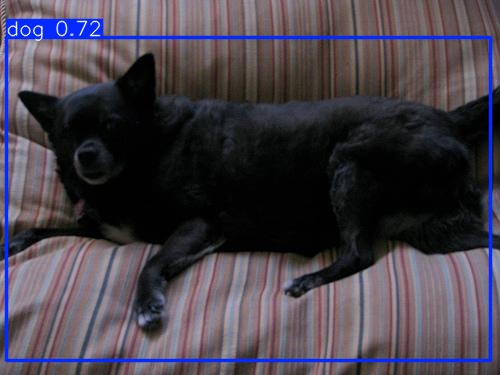
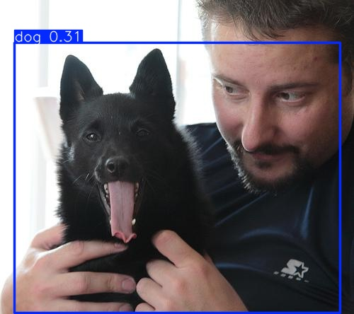

# is_the_dog_happy

Repository for the Dog emotion detection project

## Setup Instruction

Before you start, make sure you have the kaggle.json file in the current directory  
Get the kaggle.json file (Insturctions: https://arc.net/l/quote/reqqlxbn) 
<b>NOTE</b>: The downloaded file might be named different, rename to kaggle.json

1. Clone the repository
2. Run `conda env create -f environment.yml` (Pytorch has removed their conda packages, if you run into errors with pytorch, reinstall using pip)
3. Activate the environment `conda activate DOG_EMOTION`
   - <b>NOTE</b>: If you already have the environment but there are changes in the environment.yml file, run `conda env update -f environment.yml --prune`
4. Run the script `get_data.py`

## Getting Data Loader

After you got data in the stuctured format using the get_data.py, you use get_data_loaders.py to give you the train, val and test dataloader with number of classes 

1. `import sys`  
   `sys.path.insert(1, '/path/to/is_the_dog_happy')`
2. `from get_data_loaders import *`
3. Use the functions `get_loaders` to get the dataloader 
   `train_loader, vali_loader, test_loader, num_classes = get_loaders("../data")`

## Getting Started With YOLO Detector for Bounding box Experiment

1. In Notebooks folder, Locate `bounding-box-generation-yolov8.ipynb` notebook for bounding box experiment using YOLOv8.
2. Experiment Settings:
   * Taken a subset of images from imagenet data. (Approx. ~10000 images)
   * Our code split these images in training testing spit using 80-20 ratio.
   * We use images from folder name `n02085620-Chihuahua` to `n02104029-kuvasz`. (It contains 60 directories).
   * We use unseen test images from folder name `n02104365-schipperke`.
   * folder structure: (Update directory path in notebook according to your environment)
      --> dog-data/Imagenet/Annotations/
          --> n02085620-Chihuahua
              --> Image_annotation_1
              --> Image_annotation_2
      --> dog-data/Imagenet/Images/
          --> n02085620-Chihuahua
              --> Image_1.jpg
              --> Image_2.jpg
   * Above structure convert into below structure:
      --> yolo_dataset
         --> images
               --> train
                  --> image_1.jpg
                  --> image_2.jpg
               --> val
                  --> image_1.jpg
                  --> image_2.jpg
         --> labels
               --> train
                  --> image_label_1.jpg
                  --> image_label_2.jpg
               --> val
                  --> image_label_1.jpg
                  --> image_label_2.jpg
   * Copy `data.yaml`:
      ``yaml
         path: path-to-your-train-test-split-dataset  # Path to your dataset
         train: images/train
         val: images/val

         nc: 1  # Number of classes (dog)
         names: ['dog']  # Class names
      ``

* Need to run yolo model in your PC follow below steps:
   * pip install ultralytics
   * best.pt available in yolo_mode/yolo_mode_files
   * Copy `data.yaml`:
      ``yaml
         from ultralytics import YOLO
         model = YOLO("best.pt")
         results = model.predict(source="test.jpg", conf=0.25, save=True)
      ``

* Results
   * 
   * 
   * 

